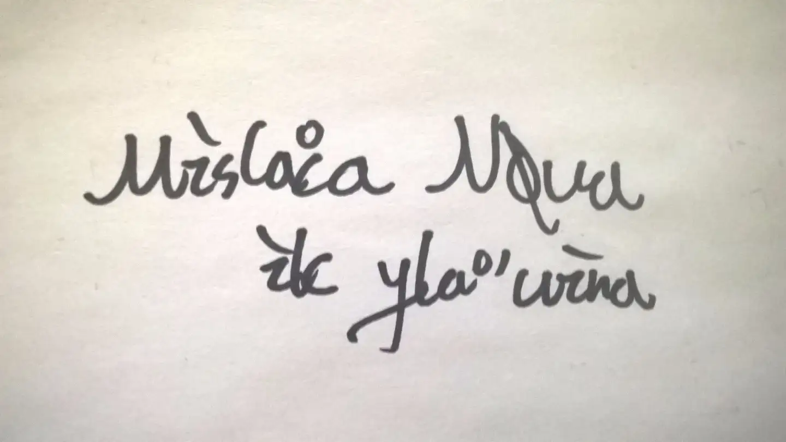
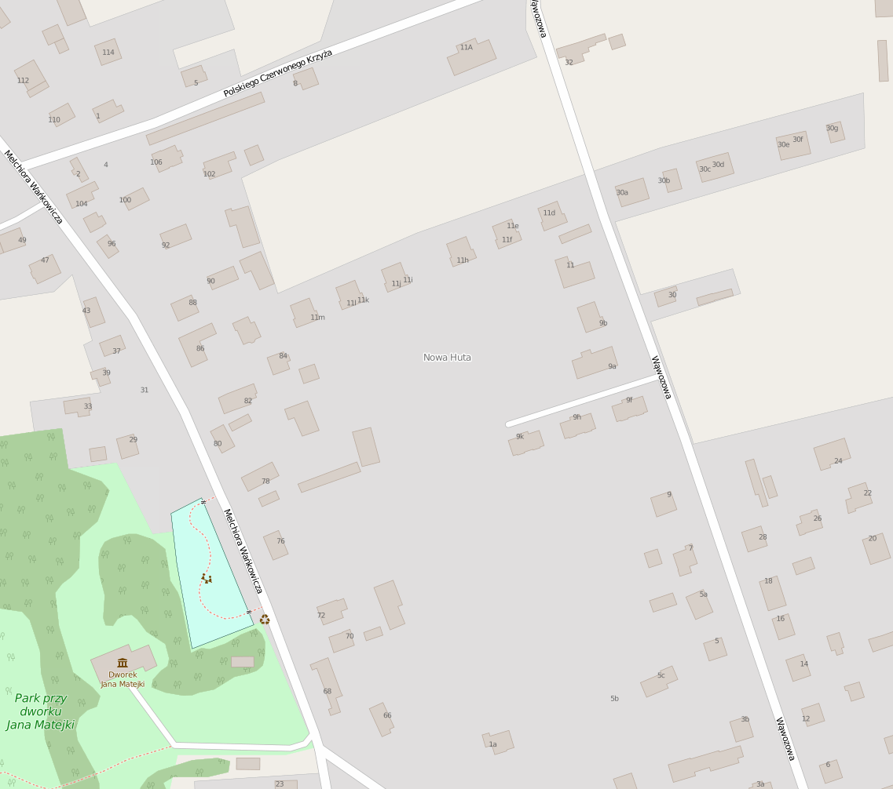
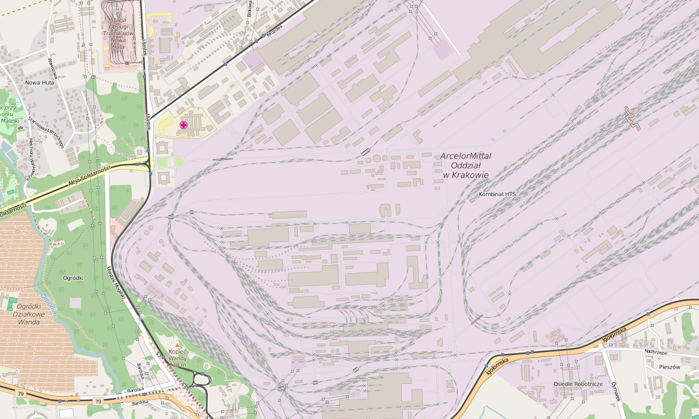
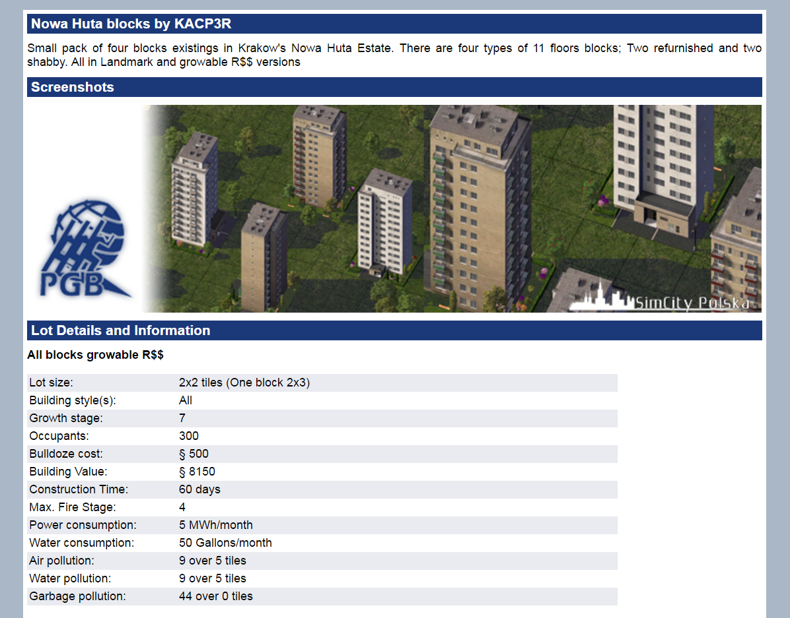

# 「Mislanka Nova」考

（題圖轉寫：Mislanka Nouva ik Ulan'mina）

## - Mislanka -

是一個僞造的東歐姓氏。至少在我捏造出這個姓氏時，我認爲自己是在僞造一個姓氏。而我僞造東歐姓氏的原因，是因爲我那時（初中時）熱衷於自己設定的一個東歐文明。他們有一個自己的語言，有一個民族國家，首都的第一高樓是一座斯大林式的摩天樓，大概是某種文化中心。

後來有人告訴我這個姓真的存在，然後我發現這個姓真的存在。

在今日的波蘭東部，有一個小村子叫「Masłanka」，而「Masłanka」似乎也是波蘭人的姓氏之一，在英文中轉寫作「Maslanka」。而也有極少數姓「Mislanka」者，當然，也是波蘭人。

## - Nova -

是一個受啓發出現的的東歐名稱。雖然諸斯拉夫民族似乎都將姓置於名後，而歐洲唯一將姓氏前置之國家匈牙利與我無關，但是「Nova」就是被擺在「Mislanka」後面了。原因不明。

英文中「Nova」指「新星」。歐洲語言中與「新」有關之詞語往往與之相近，例如西班牙語「Nueva」，法語「Neuf」，以及波蘭語「Nowy」。世界語中，「Nova」即爲「新」之意。

不過，啓發「Nova」一名的並非上述詞彙。

在波蘭克拉科夫東北部，有一片區域名叫「Nowa Huta」。在二十世紀中期，這裏修建了一些中高層的住宅大樓，在地圖上，大約如下所示：

其附近有一片鋼鐵廠，內部築有錯綜複雜的鐵路系統，停放着不少武裝列車：

而到了二十一世紀，有人將Nowa Huta這些住宅做成遊戲「模擬城市4：尖峰時刻」的插件，如下所示：

我們知道，波蘭帶給了世界《巫師》這樣的優秀遊戲。而在模擬城市圈子中，來自波蘭的插件作品因爲帶有濃厚的計劃經濟色彩，被不少中國玩家喜愛。上圖的「Nowa Huta blocks by KACP3R」即爲其中之一。而我那時正好正在遊戲中試圖復現這一風格，便收集有大量波蘭插件。也就是在那時，我碰到了「Nowa Huta」這一地名，並受此影響，有了「Nova」一名。

以上，便是「Mislanka Nova」一名的來源。

2016.7.5 16:54

